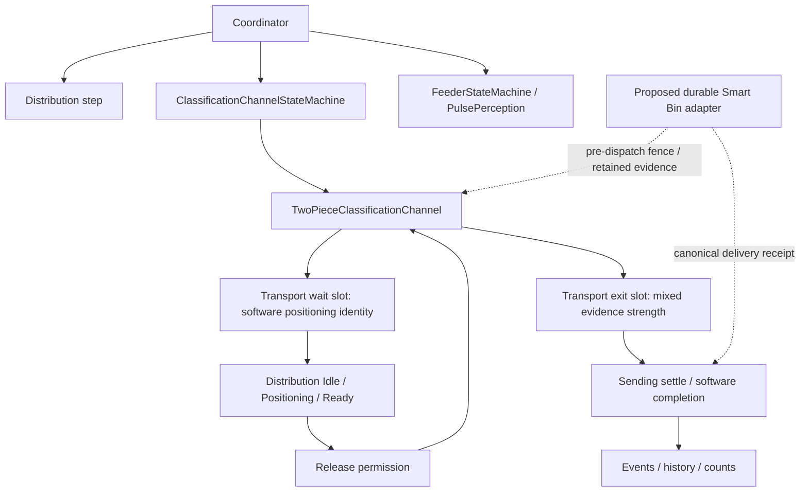

# P2C6P-B r1 — v0.3.0 architecture rebaseline

**Analysis only. Recommendation: OPTION 2, physical owner A.** No source changes,
runtime imports, tests, schema initialization, live access or hardware actions.

## Source key and evidence limits

| Key | Exact source | Meaning |
| --- | --- | --- |
| A | `2c8269843c16282659c9edbfbf03e7c7042a15ce` | Protected directly inspected live v0.2.9 source |
| B | `8951f914eb34778139b0df42f59f3957abbc2f8a` | New upstream stable v0.3.0; PR #867 integration |
| C | `c4e298ebd1a153001355df3d3b0c41cc5446ac8f` | Clean custom candidate HEAD; pre-Smart-Bin architecture |
| D | `615cb66d5d78e4f5737564f3e81b82a1c47ee9cf` | Accepted uncommitted result through C02, reconstructed from published patches |

Citations use these keys and exact source line numbers. Unless stated otherwise,
paths are relative to `software/sorter/backend/`; firmware paths are relative to
`software/firmware/sorter_interface_firmware/`. Native-flow `flow` and `base`
refer to B `subsystems/classification_channel/two_piece/`. The component table's
`D:lines` refers to its row's module. `comparison.json` records exact blobs and
SHA-256 hashes, renamed path mappings and source evidence ranges. D is a result
tree, not an implementation commit. Its published patch chain is the reproducible
source reference.

Live facts in this report are the direct read-only observations supplied in the
task. They are protected baseline evidence, not guesses or new measurements by
this task. Source inference, proposed design and later qualification are labeled
separately. Software event/count completion never substitutes for physical
receiving evidence.

## Decision: new upstream base, one native physical owner

Recommend **OPTION 2**: prepare a new, clean integration base at B after this
analysis is accepted. Recommend physical-owner **A**: the native v0.3.0 runtime
owns motion; Smart Bins supplies a durable admission/release/completion adapter.
This is the target architecture, not a claim that unmodified v0.3.0 already
satisfies the accepted Smart Bin physical-evidence contract.

Keep the old candidate and its accepted result trees intact as semantic and test
references. Do not merge its tree, restore upstream deletions wholesale, or
apply old patches to B as a compatibility experiment. Port specific contracts
and adapt tests to native identities. Preserve the original C02 result and all
historical receipts rather than retroactively recasting them as native evidence.

Exact same-path production-Python inventory comparison, excluding backend tests:

| Comparison | First / second files | Changed shared paths | First-only | Second-only |
| --- | ---: | ---: | ---: | ---: |
| A → B | 306 / 227 | 61 | 91 | 12 |
| B → C | 227 / 347 | 98 | 16 | 136 |
| C → D | 347 / 359 | 17 | 0 | 12 |

These are path counts, not semantic deletion counts; moved files appear in the
one-sided columns. They show why advancing the old dirty candidate is larger
than carrying a bounded semantic subset onto B. The full accepted C→D delta has
44 paths: **29 production paths and 15 test paths**. C's Physical C4 runtime,
marker/FIFO topology, go-to-angle machinery, and Harvest application existed
before that delta. They must not be attributed to Smart Bins.

The empirical golden remains A: the supplied direct inspection established clean
tracked v0.2.9 source, split feeder cameras, pulse-perception feeding, two-piece
classification, and one all-in-one distribution board. The measured successful
distribution windows were 36/5 min, 109/15 min, 220/30 min, 431/60 min, and
893/120 min: **7.20, 7.27, 7.33, 7.18, and 7.44 PPM** respectively. These overlap;
do not combine them into independent samples. B is the new source baseline,
not a physically qualified replacement merely because much of its path matches A.

The supplied double-feed/MISC, lost-head withdrawal, bucket multi-drop, rare motor
failures, servo rejection, and stall-clear observations are risk/context evidence.
They are not unique-piece error-rate measurements. Preserve the useful native
behavior, while giving its ambiguous branches explicit Smart Bin outcomes.

## Native flow overview

Arrows describe cooperation, not independent motion owners. Runtime step order
is Distribution, Classification, Feeder. The proposed adapter does not command
motion and never treats the exit slot as receiving proof.

## Native runtime map

1. Coordinator constructs one ClassificationChannelTransport, DistributionStateMachine, ClassificationChannelStateMachine and FeederStateMachine (coordinator.py:39–68).
2. Each ordinary tick runs Distribution, then Classification, then Feeder (coordinator.py:156–176). This order lets distribution close/open admission before classification evaluates movement, and classification publish its C3 admission gate before the feeder evaluates a pulse.
3. FeederStateMachine always instantiates PulsePerceptionFeeding (subsystems/feeder/state_machine.py:24–30). Its C3 downstream readiness combines the post-dispense admission window and classification_ready; exit-zone disappearance triggers the once-per-dispense notification (subsystems/feeder/pulse_perception/flow.py:156–180,229–268). This is a C3 exit-zone observation, not unique-piece C4 receipt.
4. ClassificationChannelStateMachine always instantiates TwoPieceClassificationChannel (subsystems/classification_channel/state_machine.py:55–72). The class owns WAITING/EJECTING/STAGING and perception-track identity, plus the C3 gate.
5. TwoPiece sets classification_ready when WAITING, C4 drop zone clear, and the stepper stopped (flow:299–335). It captures each track's own C4 crop while stopped in the drop zone, classifies on worker threads, and applies results on ticks (flow:506–557).
6. The most-forward track outside the drop zone becomes the head; an already-placed head retains the slot against phantom/re-identified tracks (flow:472–496).
7. Once a head has classification or fallback result, placePieceForDistribution writes it to the positioning slot (flow:559–603). No release has occurred at placement.
8. Distribution Idle finds an eligible positioned piece, closes distribution_ready and transitions to Positioning. It can re-position a previously prepared but undropped piece (subsystems/distribution/idle.py:15–55).
9. Positioning chooses a route, configures layer doors and chute, writes intended destination onto the object, emits a distributing event, and waits for chute/target-servo stopped (subsystems/distribution/positioning.py:123–150,175–339,354–405). MISC, oversize, sample collection and loose-piece hold use passthrough branches.
10. Ready opens distribution_ready and latches distribution_positioned_uuid from Positioning, avoiding a race when classification already advanced the slot (subsystems/distribution/ready.py:18–41).
11. TwoPiece requires placed, not ejected, distribution_ready and stage=distributing for head readiness. A captured following drop piece is also required by _maybeStartRotation; it selects EJECTING or STAGING without issuing a motor command itself (flow:605–640).
12. EJECTING issues incremental C4 move_steps through startOutputMove when stopped and a suitable gap exists (flow:642–675; two_piece/base.py:124–142). The next tick's perception checks decide slot advancement, except the timeout path described below.
13. Ready transitions to Sending on matching drop-slot identity after the positioning slot leaves, or on the legacy gate-false fallback. A disappearance/replacement without matching drop identity returns Idle (ready.py:43–84).
14. Sending reads the drop slot, waits 1500 ms normally or 400 ms for sample collection, then marks the piece distributed, emits the event, records piece history and set progress. A previously distributed object is not counted again. Cooldown delays reopening; no physical receiving sensor is consulted (sending.py:13–15,48–139).
15. The broadcaster observes known-object events (main.py:276–291); runtime_stats records distribution when distributed_at and destination_bin exist (runtime_stats.py:250–278). local_state.record_piece_distribution inserts a deduplicated event and updates bin aggregates/counts (local_state.py:1521–1630). RunRecorder separately attempts durable piece history and logs errors rather than surfacing a receipt to Sending (run_recorder.py:66–79).

Native completion remains the canonical physical-flow event source for future integration. Its present event/count labels are software accounting assertions, not proof of physical receiving destination.

## Exact transport and release evidence map

| Boundary | Native operation and source | What it proves | What it does not prove |
|---|---|---|---|
| Place | flow:597 calls placePieceForDistribution; piece_transport.py:24–28 sets _wait_piece | Software identity submitted for route positioning; observed head is outside the drop zone; classification/fallback is available | Release intent is not durable; no movement, exit or receiving proof |
| Position | positioning.py:297–339 commands doors/chute; 354–391 checks stopped | Commanded route and polled stopped state under native handling | Physical flap location or unique-piece landing |
| Ready | ready.py:20–41 opens distribution gate; flow:605–614 checks it and stage | Permission/intention to release the positioned head | No durable reservation, no durable intent, no release proof |
| Enter EJECTING | flow:634–640 | Software intent and head/next-piece selection | No motion ACK yet |
| Incremental C4 move | flow:669–675; base.py:124–142 | A successful return reports command acceptance | No exit or landing; a failed/ambiguous ACK does not prove no movement |
| Normal advance | flow:647–653, _EJECT_GONE_CONFIRM_S=0.35 at line 43 | A perception track has been absent for at least 0.35 s; native code infers it fell from C4 | Not an exit sensor; identity loss/re-ID can imitate disappearance; no receiving evidence |
| Timeout advance | flow:648–652,658–660; timeout=15 s at line 60 | Timeout elapsed; code advances even when track remains visible | No release evidence at all |
| Stall advance | flow:247–264 | A ready placed head is promoted and destination_bin cleared BEFORE clearChannelByAdvancing executes | Not even a sweep ACK; may precede a failed/no-stepper sweep or unchanged occupancy |
| Clear placement | piece_transport.py:30–40; flow:411,282,774 | Software withdraws the waiting object; identity guard can prevent clearing its replacement | Piece removal/containment; cannot prove cancellation safe |
| Drop slot | piece_transport.py:20–22,45–46 | _exit_piece references whichever _wait_piece was promoted | No intrinsic evidence strength, release reason, sequence, durable identity or completion proof |
| Sending | sending.py:75–113 | Timer elapsed and a drop object was processed once in that in-memory cycle | C4 exit on timeout/sweep paths, receiving-bin completion, durable Smart Bin receipt |
| Count | runtime_stats.py:272–278; local_state.py:1562–1630 | Software record/aggregate derived from distributed event and destination | Independent observation of actual receiver |

There are exactly two production advanceTransport callsites in B, both in TwoPiece: normal-or-timeout eject (flow:652) and stall recovery (flow:258). There is one production place callsite (flow:597). No other production class upgrades these into sensor-backed receiving evidence. The two transport slots are RAM, and _exit_piece is retained until the next advance; it is not consumed/cleared by Sending.

## Failure and recovery behavior to preserve, with evidence limits

- **Lost/replaced head:** a placed track missing longer than 0.7 s is withdrawn unless it is the active eject target. The eject target survives this retirement boundary long enough for _ejecting to commit in the same tick (flow:391–425). Ready matches UUID in the drop slot before calling a disappearance a drop (ready.py:50–65). This prevents software replacement from masquerading as advancement. The code comment “nothing fell” is stronger than its evidence: track loss/slot removal does not prove a real piece cannot still arrive.
- **Head stability:** _headPiece keeps the placed head instead of replacing it when another tracked box appears farther forward (flow:478–496). Smart reservation identity should follow that held head, never whichever track is newest.
- **Multi-drop:** distinct drop tracks across confirmation frames receive one logical group and individual multi_drop_fail objects, skip ordinary classification, and drain via MISC (flow:427–467). A lost unrouted sibling sets bucket_passthrough_hold for two eject cycles; observed empty C4 can release it early (flow:202–228,316–321,416–419,654–657).
- **Bucket hold:** Positioning opens usable doors and records destination_bin=None while hold is active (positioning.py:202–224). Hold affects routing when Positioning evaluates the piece; it is not an independently authenticated actual-receiver event.
- **Stall watchdog:** C4 state machine checks no-progress against observed occupancy after TwoPiece.step, attempts up to two output turns under automatic policy, otherwise raises an incident. During its own incident, Coordinator continues the classification watchdog while skipping distribution/feeder (state_machine.py:87–98,110–175; coordinator.py:113–155). A native adapter must include these recovery motions in the same durable release fencing.
- **Stall sweep:** a ready placed head is pre-promoted and destination cleared before the sweep; on successful observed channel-clear, uncommitted wait identity is withdrawn and in-flight pieces forgotten (flow:233–295). channel_clear.py:134–142 can return already-clear/no-stepper before moving. It opens all doors at line 156, moves in bounded steps, and rechecks channel occupancy after each step (169–187).
- **Door uncertainty:** channel-clear catches open errors and proceeds after its 2-second stop wait expires (channel_clear.py:60–99). Positioning reissues every usable door configuration because servo shadow state is untrustworthy; parked-door errors are caught; only target-servo and chute stop are awaited, and _isDoorServoStopped returns True after an exception (positioning.py:488–498,762–839). These behaviors support native safety routing but do not warrant claiming actual bucket/bin receipt after route uncertainty.
- **Teardown:** clears only the wait slot, forgets track/capture state, and releases loose-piece hold (flow:766–789). Reservations must survive teardown/restart until reconciled; teardown must not cancel them by treating missing RAM as physical absence.
- **Missing drop:** Sending reopens after a 1500-ms grace if no drop object exists (sending.py:50–72). A Smart Bin claim must continue holding capacity and gate its own release/reconciliation state even when legacy gate behavior would reopen.
- **Duplicate old drop:** Sending's stage/distributed_at check avoids recounting an already-committed drop (sending.py:86–94,122–124). Durable idempotency still needs the Smart Bin receipt and preserved request identity.

## A→B changes and C→D attribution

- A→B removes runtime selection: Coordinator, feeder mode branches and classification variants become one supported path. In this scoped runtime inventory, git diff --stat reports 48 files changed, 134 insertions, 9561 deletions. This is a bounded subsystem count, not the whole-release count.
- A two_piece.py → B two_piece/flow.py is a 98% rename with only imports, removal of obsolete vision argument, and crop helper access changed. Both timeout promotion and pre-sweep promotion already exist in A. They are inherited evidence limitations, not newly introduced B regressions.
- A→B Idle/Ready remove slot_handoff conditionals because there is now one transport. Previously slot-specific recovery is unconditional.
- B Sending removes the old global-ID vision exit-wait, its timeout incident and forceKillCarouselTrack path. Its reopen check is now settle+cooldown only (sending.py:126–139). The removed A code acted after software completion; it did not establish receiving-bin proof either.
- B Positioning adds incident-policy handling for disabled chute-jam response; native route positioning otherwise remains materially the same in this diff.
- B PulsePerception removes machine_setup-dependent classification gating because the classification channel is now always present.
- C→D does not change Coordinator, piece_transport, the native TwoPiece file, feeder state machine, or classification state machine. Their candidate divergence is pre-Smart-Bin C architecture.
- C→D changes classification marker_positioner, physical_distribution, physical_runtime and adds smart_bins_physical_bridge; also changes Distribution Positioning, Sending and StateMachine. These are accepted additions requiring semantic port/review, not a reason to retain all preexisting C physical machinery.

## Complete release-capable motion coverage

The guard must be shared by sorting, recovery and manual control; a guard installed only in Ready or on advanceTransport is too late.

| B path | Concrete dispatch | Latest safe intent/fence point |
|---|---|---|
| C3 feeding | PulsePerception _move -> move_degrees (subsystems/feeder/pulse_perception/flow.py:119–147); C3 calls from 229–268 and _apply_action 319–364 | Check downstream custody/admission before the C3 pulse. This is C3→C4 transfer, not bin delivery. Do not reuse its exit-zone disappearance as unique C4/bin receipt. |
| Initial C4 staging with no recognized head | _maybeStartRotation enters STAGING (flow:625–633); _staging dispatches at 715–717 | Before that first startOutputMove, verify whole-channel custody and confinement. “No head” means no tracked forward head, not proven physical empty. Any possibly released reserved load requires durable intent first. Unknown/clumped occupancy requires a held/quarantine discrepancy and bounded recovery authority. |
| Normal EJECTING | _maybeStartRotation selects head at 634–640; _ejecting dispatches at 673–675 | Persist RELEASE_INTENT and revalidate route/owner/identity before the first base.startOutputMove -> move_steps (base.py:124–142), not on later transport advancement. |
| Post-eject STAGING | flow:664–665 enters STAGING, whose dispatch is 715–717 | Confirm the previous attempt is reconciled and every load that this movement could release is authorized before moving again. A native timeout “ejected” flag cannot satisfy this. |
| Clump/stray/overshoot staging | Same _staging method moves until the whole drop zone clears, including fixed 25-degree nudges after the leading piece has passed precise (flow:677–717) | Guard each prospective motion against whole-channel known and unknown load state. A multi_drop_group groups track objects; it does not prove quantity. Preserve bucket safety and hold/quarantine uncertain quantity; never invent one unit of confirmed delivery from a clump. |
| Lost multi-drop bucket cycles | _holdBucket sets route override but ordinary/staging moves perform the release (flow:202–228,416–419; positioning.py:202–224) | Before the release-capable dispatch, require a qualified reject-route/evidence policy or hold for bounded recovery. Clearing an object's destination or counting two cycles is not actual-receiver evidence. |
| Stall auto-clear / requested resolution | flow:233–295 -> channel_clear.clearChannelByAdvancing -> _advanceOneStep move_steps_blocking/move_steps (channel_clear.py:102–121,169–187) | Claim reconciliation and durable intent for affected pieces precede opening doors/sweeping; snapshot all potentially released claims. Pre-sweep transport advancement at flow:258 cannot authorize itself. |
| Startup/recovery pre-home purge | main.py:636–666 opens servos then calls maybeRunSpokeHome; spoke_home.py:441–463 invokes shared clear routine | Durable unresolved-claim inspection must precede these startup/recovery side effects, before Coordinator is constructed at main.py:680. Classifying them as setup does not exempt possible physical release. |
| Spoke alignment after purge | spoke_home.py:463 runs purge, then 500–533 calculates and issues alignment move_steps | Require successful current custody/empty-channel clearance or explicit recovery authority before alignment. clearPiecesFromChannel discards the ChannelClearResult (441–454); B can continue alignment after failed purge. |
| Manual/test/calibration jog | server/routers/steppers.py:594,781,1172,1290 issue forced speed/degree commands | The same physical owner/claim fence must block conflicting normal motion and unresolved custody before manual commands. These endpoints are separate from TwoPiece/Ready. |
| Chute positioning/door changes and homing | positioning.py:297–339,395–405,762–839 and main.py:636–688 | Do not alter a receiving route while a released or uncertain piece could still arrive. Route-only movement also needs current custody ownership and any retained delivery hold, even though it is not a new C4 release. |

All autonomous TwoPiece positive-motion callsites are the two startOutputMove calls at flow:673 and 715. base.startRotation and startCaptureSweepMove are remaining helper definitions with no production callers in B; _advanceToCapture and _startEject do not exist in B. Do not accidentally reintroduce old-mode motion paths while porting. Stop commands are distinct from release-capable positive motion.

This release gate is not permission for new automatic recovery. The required implementation must preserve one physical owner, inspect current durable claims before restart/homing and route changes, and stop with an explicit reconciliation state when the physical situation cannot satisfy a qualified evidence policy.
## Proposed minimum adapter and evidence contract

The minimum additional owner state is one versioned native custody/release
record per claimed piece: immutable piece UUID, controller incarnation, native
head/transport generation, reservation and release attempt identity, route
revision, and retained evidence. Do not introduce a second planner, ten-pocket
FIFO, or marker positioner merely to populate the old DTO fields.

Native code must invoke the adapter **before every action capable of releasing a
claimed piece**, under the physical owner's lock. The adapter may refuse release
and persist evidence; it must not independently command a motor or flap. Typed
outcomes must distinguish observed absence, motor acceptance/completion,
stall/clear, forced timeout, lost identity, route change, and qualified receiving
evidence. The transport drop slot remains an association slot, not a certificate.

The native release-proof design is a genuine acceptance gate. D's
`smart_bins_delivery.py:31-67,295-325` requires pocket identity and a
`marker_confirmed` exit; B has neither that pocket owner nor a confirmed marker
index. A track disappearing after 350 ms may support an *inference* once associated
with a known release and qualified perception, but it is not marker proof or an
observed receiving-bin landing. A 15-second timeout or pre-clear slot advance
cannot qualify even that inference. Never set `marker_confirmed=True` to bridge
this mismatch. Add a versioned native evidence form in the later adapter slice,
with explicit evidence strength and stale/ambiguous cases; preserve the old form
for historical records and evidence tests.

Receiving evidence is a separate gate. D's current
`smart_bins_native_completion.py:435-479` constructs completion from retained
route, marker reference and settling time, and copies intended destination into
the actual fields. That is the accepted candidate's inference model, not an
independent landing sensor and not a generic native adapter. The port must make
this dependency explicit. It must establish whether the actual machine's
available observations can qualify a receiving route/landing for the specific
piece; source inspection cannot establish that. Do not invent a new sensor or
assert a successful software drop proves arrival. Until accepted receiving
evidence exists, retain the claim as UNCERTAIN and reconcile using attributed
evidence. If that makes ordinary reserved sorting impractical, stop the adapter
acceptance rather than weakening the contract or silently enabling it.

This keeps A as the recommended physical owner while acknowledging the missing
adapter proof. Reinstating all of Physical C4 does not by itself solve receiving
evidence: a confirmed rotor index is also distinct from bin landing.

### Smart Bin transition map

The table describes proposed integration points, not code installed by this task.

| Native boundary | Durable state / reservation | Latest intent/evidence rule | Adaptation |
| --- | --- | --- | --- |
| Feeder admission / head acquisition and classification | Create immutable owner identity; no bin credit. Reserve before any claimed release; if route/group is not known yet, retain physical custody and keep release closed. | Movement of another resident head must be included in the release guard even during capture/feeding. | Replace pocket topology with versioned native identity; retain conservative ownership. |
| `placePieceForDistribution()` / Idle→Positioning | RESERVED must be created for the selected qualified route before release becomes possible. A wait-slot object alone is not a reservation. | Capacity = recorded contents plus RESERVED, RELEASE_INTENT, EXIT_CONFIRMED and UNCERTAIN quantities. Category/route and revision must agree. | P2B allocator and P2A ledger survive semantically; native Positioning needs an adapter. |
| Positioning route prepared | RESERVED; frozen intended destination remains distinct from later actual destination. | Validate count, full route, accepted command state, and matching head generation. A rejected servo request cannot update modeled truth to success. | Merge only occupancy/eligibility and route safeguards into B; retain B behavior and identity fixes. |
| Ready opens logical gate / native release is armed | Persist RELEASE_INTENT before the first release-capable command. Conservatively prepare before exposing readiness where readiness permits release; consume a single-use permit immediately at dispatch under the same owner. | Durable intent receipt is not a replayable motor permit. Recheck owner, route/revisions, unconsumed attempt and unresolved blockers at dispatch. | Redesign old physical bridge; it must never become a second motion owner. |
| Accepted motor request / continuous speed / eject step | RELEASE_INTENT continues holding capacity. | ACK means accepted command only; lost ACK or timeout can still mean motion. No resend and no second attempt after restart. | Carry C02 wire fencing and accepted failure semantics. |
| Expected fresh disappearance after the owned release | Possible exit evidence, **not automatically EXIT_CONFIRMED**. | A new native proof type and qualification must establish the supported inference; bind frames/times/head generation/attempt/route. Otherwise UNCERTAIN. | P2C2 evidence API requires adaptation, not boolean relabeling. |
| Eject timeout with track present; pre-sweep slot advance; missing/replaced head; MCU ambiguity | UNCERTAIN for every affected claim; keep capacity and intended route. | A slot update, timeout, detector retirement, bucket intention, or successful clear cannot cancel or complete a claim. | Native reason-tagged transitions plus recovery fence. |
| Multi-drop/clump/stray or stall clearing | Preserve native MISC/bucket safety behavior; retain affected claims and record a discrepancy. | Unknown physical quantity is not one known delivered piece. Persist intent for known affected claims before sweep; unmatched material requires explicit incident/reconciliation. | Integrate at common release-capable actions; do not leave recovery as a bypass. |
| Sending settle/cooldown | EXIT_CONFIRMED remains held if qualified exit exists; otherwise UNCERTAIN. | Timer alone is not receiving proof. No bin count, delivery ID, or Harvest completion from elapsed time. | Preserve timing for ordinary flow; add guarded receipt path for reserved pieces. |
| Qualified receiving completion | COMPLETED only after immutable actual destination evidence, matching exit/attempt/identity, and atomic delivery + piece history transaction. | Different actual destination is recorded as a contradiction and reconciled; never silently copy intended or overwrite it. | Port P2C3 canonical native completion, with a redesigned evidence supplier. |
| Completion persistence/publication failure | Keep completed physical fact and durable hold; retry only exact DB receipt/readback where safe. | No second release. Current same-machine blockers override old receipt replay before callbacks/gate reopening. | P2C4/P2C5 semantics survive; adapt owner checks and native state integration. |
| Withdrawal before dispatch | RESERVED may become CANCELLED only with current-owner proof that release was never attempted and the piece cannot still arrive. | Lost visual identity alone is insufficient; after RELEASE_INTENT, reconciliation must prove nonarrival. Replacement needs a new identity/claim. | Port cancellation/reconciliation rules; do not tie cancellation to `clearPieceForDistribution()` alone. |
| Restart / explicit recovery | Retain all held states; inspect local obligations before authorizing motion. | Historical receipt does not restore physical custody. Require owner/scene requalification; no blind clear, reopen, release or automatic resend. | Recovery remains separate from source acceptance and requires later physical authority. |

P2C2–P2C5 cannot attach directly as the current Physical C4 classes. Their durable
state machine, immutable intent, one-shot dispatch, canonical completion,
same-machine current blockers and no-double-drop rules are the semantic reference.
Their pocket/marker fields, transport handoff binding and physical owner callbacks
must be adapted explicitly. One owner must authorize normal, reject and recovery
motion for the same piece.

## Module disposition

Evidence notation is `state:backend-relative-path:lines`, or `D:lines` within the row's module. Exact state IDs and Git blob hashes are in `comparison.json`.

Counts are **one per custom production module**, never per class/function: REQUIRED_NOW **2**, USEFUL_BUT_SIMPLIFIABLE **7**, DEFERRED_EXPERIMENT **9**, OBSOLETE_FOR_CURRENT_ARCHITECTURE **3**, SMART_BIN_ADAPTER_ONLY **3**; **24 custom modules** total. The inherited legacy `vision/tracking/handoff.py` is an additional audited obsolete helper, excluded from custom counts because A=C=D exactly. Hardware servo and stepper subcomponents below do not add duplicate file counts.

| Module | Class | Source-backed reason / minimum disposition | Evidence |
| --- | --- | --- | --- |
| `subsystems/classification_channel/blue_markers.py` | DEFERRED_EXPERIMENT | Blue dashed/solid marker phase recovery supports the optional absolute ten-pocket geometry. The native two-piece owner has no dependency on marker identity; preserve as a future calibration/research asset, outside the next runtime. | `D:16-161`; `B:subsystems/classification_channel/state_machine.py:55-72` |
| `subsystems/classification_channel/c3_transfer_recovery.py` | USEFUL_BUT_SIMPLIFIABLE | Fresh same-piece observations, bounded recovery, and retained uncertainty are useful requirements. Its reserved-pocket host and 12-second C3 retry policy belong to custom C3/FIFO topology; native admission can bind durable bin custody after C4 identity exists. Do not revive custom C3 agitation merely to satisfy bin accounting. | `D:1-5,11-55,109-144,268-314`; `B:subsystems/classification_channel/two_piece/flow.py:339-425` |
| `subsystems/classification_channel/complete_drain.py` | USEFUL_BUT_SIMPLIFIABLE | Retain explicit recovery authorization, unknown-custody handling, and rejection accounting; implement them around the native channel-clear primitive with durable reservation fencing. Do not import a fixed full ten-pocket sweep, marker reestablishment, or controller replacement as ordinary startup. | `D:15-22,74-119`; `B:subsystems/classification_channel/two_piece/flow.py:233-295` |
| `subsystems/classification_channel/demand_planner.py` | DEFERRED_EXPERIMENT | Demand overlap, future route deadlines and predictive chute timing optimize a ten-pocket pipeline; not necessary for the observed native two-piece machine. Although its header says offline, PhysicalC4Runtime actually instantiates it with Timing(0,0), requiring stopped alignment, so do not call the entire module currently unused. | `D:1-10,39-45,155-195`; `D:subsystems/classification_channel/physical_runtime.py:54-55` |
| `subsystems/classification_channel/indexed_pocket_pipeline.py` | OBSOLETE_FOR_CURRENT_ARCHITECTURE | The earlier ten-pocket state machine duplicates an occupancy/motion owner. Even C routes both TWO_PIECE and INDEXED_POCKET enum choices to PhysicalC4Controller, leaving this earlier pipeline outside selected runtime construction. Its contracts remain evidence; its owner is not ported. | `D:49-55,815-1000`; `C:subsystems/classification_channel/state_machine.py:99-104` |
| `subsystems/classification_channel/marker_positioner.py` | DEFERRED_EXPERIMENT | The full calibrated marker/bounded-trim positioner is optional topology. Port its later dispatch-before-motion fence and stop-before-uncertainty-persistence principles into native release, without fabricating ConfirmedIndex from native track loss or timeout. | `D:383-392,555-612,651-756`; `B:subsystems/classification_channel/two_piece/flow.py:618-675` |
| `subsystems/classification_channel/marker_source.py` | DEFERRED_EXPERIMENT | Network JPEG capture epoch/sequence and blue-marker phase reading are optional marker feedback infrastructure. The native flow already consumes perception; adding a blocking marker source is not required for ordinary bin reservations. | `D:1-18,45-91,138-183`; `B:subsystems/classification_channel/two_piece/flow.py:299-365` |
| `subsystems/classification_channel/physical_controller.py` | DEFERRED_EXPERIMENT | This replaces native runtime selection, requires marker reference/mapping inputs, installs C3 reservation callbacks, and automatically establishes/sweeps unknown ten-pocket state. The actual provided golden operates the native two-piece path. Preserve a dormant research branch, not a second owner in production. | `D:39-54,57-102,143-205,540-565,612-663`; `B:subsystems/classification_channel/state_machine.py:55-98` |
| `subsystems/classification_channel/physical_distribution.py` | SMART_BIN_ADAPTER_ONLY | Keep identity retention, one downstream completion owner, reservation handoff and native canonical accounting. Replace marker/FIFO discharge and route scheduling with native transport callbacks; do not retain a second physical distribution scheduler. | `D:46-56,58-107,109-150`; `B:subsystems/distribution/ready.py:25-84` |
| `subsystems/classification_channel/physical_fifo.py` | DEFERRED_EXPERIMENT | Its ten fixed stations, generation mapping, P0->P9 release sweep and fixed intake P6 are alternate transport geometry. No requirement for ten simultaneous pocket owners is established for the supplied native golden. Stable native custody IDs replace pocket identity; do not mislabel software slot advancement as physical proof. | `D:1-12,21-23,61-68,120-161,202-241`; `B:subsystems/classification_channel/two_piece/flow.py:80-117` |
| `subsystems/classification_channel/physical_handoff.py` | USEFUL_BUT_SIMPLIFIABLE | Keep original-piece identity and uncertainty distinct from fresh images or motor ACK. Its C3-to-reserved-FIFO-pocket adapter is not required when Smart Bin custody starts from the native C4 KnownObject. No native C3 delivered event may be promoted into receiving/bin proof. | `D:38-80,82-126`; `B:subsystems/feeder/pulse_perception/flow.py:156-173` |
| `subsystems/classification_channel/physical_runtime.py` | DEFERRED_EXPERIMENT | Single-writer custody is required, but this implementation couples FIFO, marker positioner, planner and custom recognition journeys. Native TwoPiece is the one writer. Extract C->D pre-dispatch, uncertainty, retained-completion semantics into the adapter; leave custom runtime dormant. | `D:1-6,38-69,83-104,158-217,288-325,344-374`; `B:subsystems/classification_channel/state_machine.py:55-98` |
| `subsystems/classification_channel/pocket_ledger.py` | OBSOLETE_FOR_CURRENT_ARCHITECTURE | Earlier logical index-count ledger belongs to IndexedPocketPipeline and retires ownership by sequential index count. Native identity/transport plus durable bin ledger removes this competing map; do not use its advance counter as receiving evidence. | `D:32-51,79-107`; `D:subsystems/classification_channel/indexed_pocket_pipeline.py:49-55` |
| `subsystems/classification_channel/transfer_episode.py` | USEFUL_BUT_SIMPLIFIABLE | Keep stable owner incarnation, native piece UUID and release-attempt identity. The existing episode's pocket/boundary numbers, multiple C3 jitter stages and retained-transfer history are not a mandatory Smart Bin API. Introduce typed native custody rather than fake pocket numbers. | `D:1-53`; `D:subsystems/classification_channel/smart_bins_physical_bridge.py:127-142` |
| `subsystems/classification_channel/smart_bins_physical_bridge.py` | SMART_BIN_ADAPTER_ONLY | The accepted bridge is optional and inactive; constructor attachment is not wired by PhysicalC4Controller. Preserve durable intent before dispatch, one consumed permission, unknown-ACK retention and no-motion completion repair. Redesign the bridge around native evidence instead of requiring a marker-bound ten-pocket owner. | `D:1-7,48-98,214-241,252-308,317-397`; `D:subsystems/classification_channel/physical_controller.py:198-205` |
| `subsystems/distribution/flap_path.py` | REQUIRED_NOW | Narrow accepted path verification is needed: every actual flap must be available/calibrated, stopped, and at the required open/closed state before a guarded release. B opens only usable flaps, ignores bool rejections and waits only target stop. Preserve B Ready identity/race fixes while porting this semantic gap; servo shadow is not a receiving sensor. | `D:4-36`; `B:subsystems/distribution/positioning.py:488-498,762-840;B:subsystems/distribution/ready.py:20-84` |
| `recognition_journey.py` | DEFERRED_EXPERIMENT | Optional multi-camera recognition association and enrichment are independent of durable delivery; this module explicitly owns no transport/motor/controller. Native crop/classification is sufficient for the next release; preserve native per-piece identity and classify separately before adopting optional journeys. | `D:1-6,24-38,72-104,615-686`; `B:subsystems/classification_channel/two_piece/flow.py:506-558` |
| `recognition_journey_capture.py` | DEFERRED_EXPERIMENT | Explicit optional in-memory/history/freefall enrichment, which must not authorize transport. Avoid porting image-history scene machinery just to reuse Smart Bin accounting. | `D:1-6,16-23,101-107,137-145`; `B:subsystems/classification_channel/two_piece/flow.py:506-538` |
| `subsystems/feeder/go_to_angle/recovery.py` | USEFUL_BUT_SIMPLIFIABLE | Geometry-only same-piece freshness and motor-progress-versus-piece-progress distinctions remain useful references. Its former package has been removed by B. No need to restore go-to-angle mode or the full follower-sweep/jitter planner for native bin release. | `D:1-5,53-58,74-98`; `B:subsystems/feeder/state_machine.py` |
| `subsystems/feeder/go_to_angle/flow.py` | OBSOLETE_FOR_CURRENT_ARCHITECTURE | Legacy feeder runtime is removed by B. Its finite-motion and no-retry safeguards may inform the native adapter, but restoring a selectable go-to-angle owner conflicts with single native pulse-perception operation. | `D:133-223,633-633,861-861,1094-1094`; `B:subsystems/feeder/state_machine.py` |
| `subsystems/feeder/pulse_perception/flow.py` | USEFUL_BUT_SIMPLIFIABLE | Retain B's selected feeder and timing behavior. C's custom additions read exact targets and add C3/FIFO reservation/recovery callbacks; retain command-ambiguity safety where necessary, but omit its custom recovery owner and do not promote B's dispatch-time delivered notification to custody proof. | `D:131-156,221-224,449-476,616-637`; `B:119-173` |
| `vision/tracking/handoff.py` | OBSOLETE_FOR_CURRENT_ARCHITECTURE | This is inherited legacy code (A=C=D), not custom or Smart Bin work. Its cross-camera time-window FIFO identity matching was removed in B and is not physical custody evidence; it should not be restored. | `D:1-11,53-81`; `A=C=D blob equality; B absent` |
| `subsystems/shared_variables.py` | USEFUL_BUT_SIMPLIFIABLE | Retain native classification/distribution gates. Replace C's c4_runtime_owner/reserve_c4_transfer/request_c3_recovery hooks with one narrow native adapter binding; gate booleans cannot establish delivery or erase durable holds. | `D:31-45,96-109`; `B:subsystems/classification_channel/state_machine.py:87-98` |
| `smart_bins_native_completion.py` | SMART_BIN_ADAPTER_ONLY | Keep same-key receipt readback, atomic completion and follow-up gating, but replace marker/pocket-based NativeHandoff. Completion must require separately accepted receiving evidence; copying intended destination into actual fields is not sufficient after porting to native flow. | `D:37-69,72-106,118-188,435-479`; `B:subsystems/distribution/ready.py:43-84` |
| `hardware/sorter_interface.py` | REQUIRED_NOW | Port accepted/rejected/uncertain Servo state truth and generation-scoped finite-motion ownership semantics narrowly. B writes current angle on rejected move response; D stores pending angle and confirms controller stop/position, invalidating uncertainty. D Stepper receipts are useful command identity but explicitly do not prove physical delivery; no wholesale hardware-module replacement. | `D:168-181,243-297,816-878,950-956`; `B:669-729,784-799` |

## Required narrow hardware and route residue

`flap_path.py` is not a physical owner. It validates every real flap rather than only the chosen layer. Its semantic contract survives independently of marker/FIFO topology.

B `positioning.py:762-840` commands available doors but skips unavailable doors, ignores false open/close returns and records intended states. B `_isDoorServoStopped:488-498` checks only the selected door and treats read exceptions as true; READY opens its gate at `ready.py:20-23`. D's full-path helper requires availability, calibration, stopped state and correct open/closed position (`flap_path.py:4-36`), with route rechecks in candidate `ready.py:51-53,90-101`.

Those checks depend on command-state truth: B `hardware/sorter_interface.py:669-729` writes the target shadow angle even when the response reports failure. D `ServoMotor._command_angle:835-878` retains pending command state only after acceptance and invalidates position on uncertain I/O; `_refresh_motion:816-833` checks controller stop plus reported target. Port this narrowly with the required flap semantics.

D's `StepperMoveReceipt`, motion generation and stationary checks (:168-181,243-297) are useful finite-command identity primitives. The source explicitly says no encoder exists and pulse-counter completion is not piece displacement/delivery (:271-275). Port only native-owner-consumed identity/ambiguity hooks; remove marker telemetry dependencies from the native hot path. Do not port the entire older hardware module.

Preserve **B's** READY fix for the Positioning-to-READY scheduling race (`ready.py:25-41`) and its matching drop-slot UUID check (:50-64,82-84). C/D READY reads the current positioning slot (:30-40) and regards any departure as advanced (:75-79); mechanically replacing B READY would regress native withdrawal/replacement handling.

## Accepted production change survival (complete C→D inventory)

All 29 production paths changed by the accepted chain are classified below.
`CARRY_AS_IS` for C01 means keep the already-equivalent B implementation. For
inactive ledger modules it means carry their contract/source initially, not an
assertion that native custody can use the old marker form. Future schema and
evidence adaptations remain explicit slice boundaries. Historical evidence is
never deleted because an adapter is redesigned.

| Accepted path (backend-relative) | Classification | Decision and source evidence |
| --- | --- | --- |
| `channel_crop_store.py` | **CARRY_AS_IS** | Retain B: C01 retention implementation already has the same normalized AST. No duplicate custom patch. D `channel_crop_store.py:1`. |
| `defs/events.py` | **PORT_SEMANTICS** | Carry optional native machine/reservation/delivery provenance into B event schema; omit unrelated candidate C4/Harvest expansion. D `defs/events.py:115`. |
| `defs/known_object.py` | **PORT_SEMANTICS** | Carry immutable native provenance, bound to new native owner identity; do not port marker/FIFO fields just to mimic old custody. D `defs/known_object.py:114`. |
| `hardware/bus.py` | **MERGE_REQUIRED** | Keep B chunk acquisition; port D validation, one write, same-address unresolved fence, valid-NACK and optional profiling contracts. These stronger wire semantics originated in C and were preserved by C02. D `hardware/bus.py:168`. |
| `harvest_integration_storage.py` | **CARRY_AS_IS** | Retain inactive immutable Harvest receipt/hash helper; full check_request API remains unusable until optional Harvest store exists. D `harvest_integration_storage.py:74`. |
| `local_state.py` | **MERGE_REQUIRED** | Port one-snapshot occupancy evidence; retain B power-stress tables, WAL setup and centralized TOML resolver. D `local_state.py:1951`. |
| `piece_image_store.py` | **CARRY_AS_IS** | Retain B: C01 piece/link retention semantics already present; keep deletion outside SQLite writer work. D `piece_image_store.py:1`. |
| `piece_records.py` | **MERGE_REQUIRED** | Extract B current upsert into caller-owned connection API and explicit preinitialization; preserve corrections and atomic delivery/history commit. D `piece_records.py:204`. |
| `project_harvest_projects.py` | **DEFER** | Preserve accepted P2C6A exact allocation/readback/cancel extensions as reference. A/B have no Harvest store; defer port of optional store application until separately scoped work. D `project_harvest_projects.py:4983`. |
| `run_recorder.py` | **PORT_SEMANTICS** | Adopt an already committed native history receipt without a second upsert; merge with B recorder shape. D `run_recorder.py:89`. |
| `runtime_stats.py` | **MERGE_REQUIRED** | Port sticky verified provenance and suppress legacy count writer only for verified canonical native delivery; preserve B telemetry and unrelated ordinary path. D `runtime_stats.py:458`. |
| `smart_bins_completion_recovery.py` | **PORT_SEMANTICS** | Retain receipt replay and current same-machine blockers/CLOSE semantics; adapt custody evidence fields and optimize all-history authorization only with equivalence proof. D `smart_bins_completion_recovery.py:481`. |
| `smart_bins_delivery.py` | **REDESIGN_ADAPTER** | Keep durable lifecycle/atomic completion rules; replace marker-only proof API with versioned native evidence, preserve legacy receipts and separate actual destination. D `smart_bins_delivery.py:295`. |
| `smart_bins_eligibility.py` | **CARRY_AS_IS** | Pure classification/dimension rules carry unchanged; group identity and capacity projection remain external inputs. D `smart_bins_eligibility.py:15`. |
| `smart_bins_followup_reconciliation.py` | **PORT_SEMANTICS** | Retain per-effect obligations, historical receipts, late-hold detection and no physical authority; adapt native owner fields without automatic recovery. D `smart_bins_followup_reconciliation.py:279`. |
| `smart_bins_harvest_integration.py` | **CARRY_AS_IS** | Retain inactive local cross-store journal after local dependencies port; no native transport ownership or ordinary runtime hook. D `smart_bins_harvest_integration.py:975`. |
| `smart_bins_migration.py` | **PORT_SEMANTICS** | Keep non-destructive legacy lineage/projection/backfill semantics; verify B legacy row schema, adapt history metadata and later bound live projection queries. No production backfill now. D `smart_bins_migration.py:719`. |
| `smart_bins_native_completion.py` | **REDESIGN_ADAPTER** | Replace bridge.index/pocket/marker-specific capture with native owner handoff and receiving evidence; retain canonical receipt/publication/current-blocker rules. D `smart_bins_native_completion.py:118`. |
| `smart_bins_reconciliation.py` | **PORT_SEMANTICS** | Retain no-motion evidence-based disposition, immutable audits, revision checks and held capacity; replace marker/pocket owner snapshots with typed native snapshots. D `smart_bins_reconciliation.py:67`. |
| `smart_bins_service.py` | **PORT_SEMANTICS** | Keep revision checks, contents plus held claims, idempotent reserve and evidence-required cancellation; adapt optional owner identity to native transport. D `smart_bins_service.py:523`. |
| `smart_bins_storage.py` | **CARRY_AS_IS** | Keep explicit v2 schema, immutable facts and FULL/FK caller transaction contract as the initial inactive port. A later versioned native-custody extension is a separate reviewed migration, never fake pocket values. D `smart_bins_storage.py:309`. |
| `subsystems/classification_channel/marker_positioner.py` | **REDESIGN_ADAPTER** | Do not port marker owner. Move accepted durable-intent/before-dispatch/uncertainty semantics into native release adapter; retain old marker tests as reference. D `subsystems/classification_channel/marker_positioner.py:1`. |
| `subsystems/classification_channel/physical_distribution.py` | **REDESIGN_ADAPTER** | Replace guarded Physical C4 transport handoff with native transport generation/custody adapter; no competing movement owner. D `subsystems/classification_channel/physical_distribution.py:1`. |
| `subsystems/classification_channel/physical_runtime.py` | **REDESIGN_ADAPTER** | Keep claim binding and failure retention semantics with native generations; omit custom FIFO runtime ownership. D `subsystems/classification_channel/physical_runtime.py:1`. |
| `subsystems/classification_channel/smart_bins_physical_bridge.py` | **REDESIGN_ADAPTER** | Replace Pocket/IndexTarget/ConfirmedIndex owner binding; preserve intent-before-dispatch, single-use permit, late/failed ACK uncertainty and durable exit before ownership retirement. D `subsystems/classification_channel/smart_bins_physical_bridge.py:298`. |
| `subsystems/distribution/positioning.py` | **MERGE_REQUIRED** | Merge P1 eligibility/occupancy/capacity behavior and new reservation integration into B. Keep native identity/withdrawal and routing changes; do not import legacy Harvest runtime call. D `subsystems/distribution/positioning.py:1`. |
| `subsystems/distribution/sending.py` | **REDESIGN_ADAPTER** | Retain B ordinary timing path; add receipt-backed completion with qualified evidence, current-owner fencing, bounded publication and no repeat physical release. Do not resurrect removed global-tracker gate wholesale. D `subsystems/distribution/sending.py:194`. |
| `subsystems/distribution/state_machine.py` | **MERGE_REQUIRED** | Port explicit optional adapter injection to B state machine; keep the one native runtime and fail closed for reserved identity without the guard. D `subsystems/distribution/state_machine.py:16`. |
| `utils/event.py` | **PORT_SEMANTICS** | Propagate the three verified native provenance fields through B event serialization. D `utils/event.py:40`. |

`subsystems/distribution/ready.py` is **not changed C→D**. Its candidate flap
recheck predates Smart Bins, and B adds positioned-UUID/drop-identity race
protection. It therefore needs a **MERGE_REQUIRED** safety integration in the
future physical slice, retaining B's identity check and adding only the narrow
route/claim guard. Do not present the entire candidate Ready as an accepted
Smart Bin patch. Native runtime files, `hardware/sorter_interface.py`, startup
and manual recovery entry points are similarly new integration surfaces, not
files in the accepted C→D patch set.

Test evidence also needs translation: C02's chunk/no-resend tests are reusable;
old bus-to-go-to-angle motor-owner fixtures refer to a feeder B removed. Extract
the wire invariants and bind owner tests to native release actions. Preserve
Smart Bin fault/rollback/replay assertions while substituting genuine native
evidence cases. Passing old marker-FIFO tests cannot qualify a different native
physical owner.

## Harvest dependency assessment

**Neither A nor B contains any Harvest-named source path.** The candidate's
`project_harvest_projects.py`, `project_harvest_runtime.py`, provider/UI support and
existing runtime calls are pre-Smart-Bin custom code in C. They were not removed
or renamed by the v0.3.0 refactor. Reintroducing that entire application would
expand the minimum ordinary-sorting integration unnecessarily.

| Interface | B status | D / required disposition |
| --- | --- | --- |
| `local_state._connect`, `local_state_db_path`, sorting sessions, `irl.bin_layout._parseLayersDict` | Present: B local_state.py:77,105; bin_layout.py:174 | Local journal dependency can port against these, retaining FULL/FK transactions. |
| Native KnownObject, `knownObjectToEvent`, RunRecorder, runtime stats, Distribution transport | Present, but evolved | Carry only native reservation/delivery provenance and canonical completion semantics. |
| `HarvestProjectStore`, `propose_allocation`, `propose_live_allocation`, `confirm_allocation`, `has_active_runtime` | Absent in A/B | Retain candidate source/evidence; defer optional store application integration. |
| P2C6A `initialize_integration_schema`, `lookup_integration_allocation`, `cancel_integration_allocation`, `integration_request` arguments | Absent in B; new accepted D extensions | Preserve exact immutable request/readback/cancel semantics when optional store is ported. No ordinary runtime caller. |
| `smart_bins_harvest_integration` | Absent in B; self-contained local journal in D | May remain inactive essentially unchanged once local Smart Bin dependencies are ported. It records observations and calls neither Harvest nor a physical owner. |
| `harvest_integration_storage` | Absent in B | Can remain dormant with journal canonical/hash helpers. Its `check_request` lazily requires `HarvestProjectError` and actual Harvest allocation tables; invoking that API requires the optional store, not just this file. |
| D PhysicalNativeBridge / `NativeCompletionAdapter` | No native B equivalent | Replace physical binding; do not rewrite the inactive journal around transport. A later narrow outbox/callback supplies canonical delivery IDs. |

D `smart_bins_harvest_integration.py:1-21,495-512,975-1088` establishes separate
stores, local lock ordering and a caller-owned completion staging seam. D
`harvest_integration_storage.py:1-25,74-76` requires no runtime startup but has
the optional store dependency noted above. D `project_harvest_projects.py:4968-5045`
adds explicit schema installation, exact read-only allocation lookup, and
planned-only cancellation after local safe cancellation. There is no distributed
transaction. Keep these contracts as the P2C6A reference.

D's legacy ordinary Positioning calls `reserve_piece` before it knows Harvest is
active (`positioning.py:153,389-397`); `project_harvest_runtime.py:145-151` obtains
a store and queries `has_active_runtime` when a Harvest root is configured. This
is an existing custom dependency, not a property of the inactive P2C6A journal.
**Do not port those ordinary-path calls.** Ordinary v0.3.0 sorting must work with
Harvest application/provider modules and external stores absent. The unchanged
local recovery inspector imports the bundled inactive journal and its hash helper
(`smart_bins_delivery.py:633-634`); those local modules remain present but require
no Harvest database or provider. A future explicit project capability
may call Harvest outside every local SQLite transaction. Confirmation failure
after a native physical delivery becomes a project follow-up; it cannot authorize
another physical release or move authority out of the local Smart Bin DB.

P2C6A may remain unchanged in the archived candidate as an accepted inactive
foundation. On the new base, the local journal and hashing helper can be carried
inactive; the optional Harvest-side store extensions remain deferred. This is
not P2C6B and gives no authority to activate its runtime integration.

## Config and machine.toml

| Live-style configuration | B behavior | Classification / consequence |
| --- | --- | --- |
| `[machine_setup]`, its selection keys, historical feeder/classification mode selectors | Runtime constants are `classification_channel`, `pulse_perception_rev01`, `two_piece_state_machine_rev01`; feeder always constructs PulsePerceptionFeeding. Old selection keys have no runtime reader. | Safely ignored for supplied already-compatible topology; no migration and no automatic rewrite. Operator cleanup can follow separately. |
| `[feeder_go_to_angle]` | Getter/setter and implementation removed. | Safely ignored TOML block; cannot select the removed flow. |
| `[feeder_constant_movement]` | Getter/setter and implementation removed. | Safely ignored TOML block; cannot select the removed flow. |
| `[feeder_pulse_perception]` | Parsed, defaults merged, unknown keys filtered. Shared `move_speed_usteps_per_s` and `max_move_output_deg` seed the three per-channel fields; explicit channel fields win. | Still accepted; explicit in-memory migration of those two retired keys, without writing the file during reads. |
| Split camera sources `c_channel_2`, `c_channel_3`, `classification_channel` | Directly instantiated, with per-role capture modes, picture and device settings. | Still accepted. |
| Historical camera `carousel` | Accepted as fallback for classification source/settings; canonical `classification_channel` is checked first. CameraService exposes both aliases over the same camera device. | Still accepted; no rename required. If both conflicting values exist canonical role wins, so a later config-only review should flag the conflict. |
| Old combined feeder, classification_top/bottom camera entries and layout selection | No longer included by camera getter or service construction. | Ignored; no automatic split migration. An old machine depending only on these entries would lose required camera coverage. This supplied machine is already split. |
| Motor role `carousel` | Still a required canonical binding; aliased to both c_channel_4_rotor_stepper and classification_channel_rotor_stepper. | Still accepted and matches distribution-v1-2 firmware naming. |

Evidence: B `irl/config.py:6-10,744-767,770-875,883-887,1079-1081`; B `subsystems/feeder/state_machine.py:24-30`; B `toml_config.py:270-299,728-754`; B `subsystems/feeder/pulse_perception/config.py:140-189`; B `vision/camera_service.py:24-30,72-109`. A-to-B source diff removes go-to-angle and constant-movement accessors. Full-backend symbol search finds machine_setup/feeder_mode remaining in telemetry/history fields, not configuration selection.

B `machine_toml.py:14-29` centralizes the filename: default `software/machine.toml`; absolute override retained, relative `MACHINE_SPECIFIC_PARAMS_PATH` resolved from backend directory independently of working directory. This helper already exists in A; it is not a new A-to-B migration. C/D retain old local_state `_legacy_machine_params_path` fallback to backend `machine_params.toml`, and resolve relative overrides against process working directory. B `local_state.py:85-102,144-149,320` resolves legacy data/polygons/servo state adjacent to the central TOML file. Preserve B resolution in the new base; do not transplant D's old resolver. Neither resolver moves an existing file. Historical config blocks are not rejected merely for being unknown, but malformed TOML still exits (`toml_config.py:52-57`).

## SQLite and accepted shared transactions

| Concern | A live source | B stable | C / D candidate |
| --- | --- | --- | --- |
| local_state schema version | 5 | 5; adds power_stress_runs, power_stress_events and event index | 5; lacks B power-stress schema; Smart Bin schema v2 separately versioned in D |
| Database path | backend local_state.sqlite or LOCAL_STATE_DB_PATH | same | same |
| Per-operation local_state connection | WAL, synchronous=NORMAL, foreign_keys=ON, timeout 5 seconds / busy_timeout 5000 ms | identical | identical |
| WAL keeper | one idle process-lifetime connection; avoids last-connection checkpoint each operation | identical | C already adds resolved-path tracking, keeper replacement and explicit close helper; D retains it |
| Accepted C-to-D local_state addition | absent | absent | get_current_bin_occupancy_evidence: one read transaction covering current counts and category aggregates; includes aggregate-only rows and preserves inconsistencies for refusal |
| History writer | owns its own connection and commit | same API | D adds initialize_piece_records plus recordPieceOnConnection, which owns neither connection nor commit |

B evidence: `local_state.py:19-47,77-131,451-762`; A-to-B entire local_state diff contains only the power-stress additions (`637-667` and `2445-2616` in B). D evidence: `local_state.py:29-70,103-113,1949-1983`; C-to-D local_state diff is only occupancy evidence. Consequently keeper robustness, bulk metadata queries, selected-bin clearing and candidate-era schema/history fields must not be attributed to Smart Bins.

Smart Bin `critical_transaction` uses the same local-state database through `_connect`, raises synchronous to FULL and verifies FULL/FK before `BEGIN IMMEDIATE`; it rejects nested transactions, requires explicit caller commit and rolls back an uncommitted exit. Caller-supplied connections remain open with original pragmas restored afterwards. Schema initialization is explicit, requires existing sorting_sessions, and is not performed on ordinary read. Preserve this contract exactly; ordinary B NORMAL is not permission to weaken physical reservation durability (D `smart_bins_storage.py:228-337`).

D `smart_bins_delivery.py:356-358` initializes piece_records before its critical transaction. `recordPieceOnConnection` writes delivered history inside the same transaction as Smart Bin delivery, reservation completion, evidence and receipt (`438-465`), avoiding an independently committed history side effect. B `piece_records.py:24-41,192-224` still opens its own connection and commits in recordPiece, so that helper must be ported with B's current schema. Do not call a schema-initializing normal writer while holding the critical transaction. B piece_records does not explicitly select NORMAL; do not generalize local_state NORMAL to all writers.

The intended destination stays immutable in reservations/deliveries while actual destination is stored separately. D native completion checks actual destination qualification and refuses a mismatch into UNCERTAIN with a discrepancy rather than crediting an arbitrary intended bin (`smart_bins_delivery.py:389-427`).

### Opportunities to examine later, without weakening durability

- Keep the existing atomic delivery + history + receipt transaction rather than adding a second recordPiece write/commit.
- Combine only writes describing the same physical boundary. RELEASE_INTENT must commit before potentially releasing motion; a later exit/completion transaction cannot replace that prior durable boundary.
- Pass a committed receipt or bounded current snapshot between layers where it can remove duplicate normal reads, but retain required durable readback after ambiguous commit and same-machine blocker revalidation before side effects.
- Receipt replay paths call commit even when no new rows were changed. Do not count these calls as measured fsyncs; measure transaction wait, actual writes and commit latency separately. A read-only receipt lookup may avoid BEGIN IMMEDIATE contention only if the later current authorization check remains intact.
- Keeper prevents gratuitous last-connection checkpoints but not WAL autocheckpoints, writer contention, or FULL commit cost. The 5-second busy timeout is an upper bound on waiting, not evidence that the sorter can tolerate it. Retention sweeps and initialization calls must remain out of the release-critical transaction.

## Firmware compatibility

Verified commit `8d560d26b60b09145d0c7c62ac81f2fb3c22a60c` and B have the identical entire firmware tree `06181d87b2258fcce1581145cea672daaa2b5702`, including implementation blob `3c5abfbd83039b1902eae0bb7e2cce5d9a5f18cc` for sorter_interface_firmware.cpp. This is stronger than checking a version string; all firmware implementation/config/build files match. No new firmware requirement or flash is indicated by this source comparison. Firmware compatibility is source evidence; no build, live query or physical qualification was performed.

- Command codes match table-index/high-nibble dispatch: stepper move/speed/limits/acceleration/status/position/home/jitter/stall occupy `0x10-0x1c`; driver commands `0x20-0x22,0x28-0x29`; digital `0x30-0x32`; servo move/speed/acceleration/position/status/enable/duty/release `0x40-0x44,0x46-0x48`. Firmware retains STOP `0x45`, but B no longer invokes it in ServoMotor.stop.
- `ServoMotor.stop` sends SET_ENABLED false, because firmware STOP holds its modeled stored angle, potentially boot-time zero. Disabling calls stopMotion then sets SERVO_DISABLED and duty=0. Preserve B stop/release behavior; no servo-position inference from a stop ACK.
- MOVE_TO_AND_RELEASE `0x48` sends little-endian `<HH`: angle in tenths of a degree plus maximum duration in ms. Firmware accepts legacy 2-byte or current 4-byte payload, returns one-byte accepted flag, and releases PWM at modeled target or hard deadline. This models motion; it is not measured flap position. B currently updates its cached angle even when the returned flag is false; a Smart Bin route adapter must not treat that cache or stopped flag as route evidence.
- StallGuard enable/status/clear (`0x1a/0x1b/0x1c`) are supported. Status is a board bitmask, not per-query channel evidence. The v1-2 header supplies DIAG pins for all five motors. Monitor retains previous stall state on failed status reads, parks a running stalled machine, and invalidates chute homing after a stall. The legacy kill switch exists for boards without usable DIAG; it should not be changed in this task.
- Framing remains COBS with zero terminator, four-byte address/command/channel/payload-length header, 32-bit CRC, 246-byte maximum payload. Firmware response channel is not populated by handleMessage; it cannot be used as fresh motor-identity evidence. No transaction identifier or deduplication exists, so ambiguous whole-command retry can duplicate motion; C02 remains necessary.
- Distribution-v1-2 build uses distribution role + HW_BASICALLY_V1_2. Header defines five steppers including carousel; B discovers basically_rp2040 v1-2 profile and preserves the carousel-to-classification aliases. This matches the supplied all-in-one board topology.

Evidence: B backend `hardware/sorter_interface.py:16-57,690-750,956-963`; `stepper_stall_monitor.py:79-120`; `machine_platform/control_board.py:88-101,370-374`; `irl/config.py:1079-1081`. Firmware `sorter_interface_firmware.cpp:49-157,807-855,879-893`; `message.h:32-39`; `message.cpp:49-80,96-125,149-169`; `cobs.h:34`; `Servo.cpp:75-106,225-255`; `Stepper.cpp:272-280`; `hwcfg_basically_v1_2.h:7-25,41-51`; `Makefile:50-53`.

## Performance and synchronous work

The inspected functions are potential integration costs, not measured PPM losses.
Most durable Smart Bin paths are inactive/injected in D; they are not all running
on the live A machine or even automatically attached in the candidate. The
legacy occupancy allocator is already called by D Positioning. Model eventual
frequency before putting dormant services on every coordinator tick.

| Operation and source in D | Frequency if ported | Work and risk | Recommendation for later bounded work |
| --- | --- | --- | --- |
| Occupancy lookup, local_state.py:1951-1984; positioning.py:1011 onward | Every routed ordinary piece | One snapshot of bin counts and grouped category rows; setup/path must not initialize repeatedly on hot path. | Preserve fail-closed inconsistent/unknown occupancy. Measure snapshot time and scanned row count. |
| `smart_bins_service._select/_candidate`:346-469; `preview`:471-479 | Reserved pieces; preview can duplicate selection | Per-slot queries, configuration checks and contents projection. Full candidate list rather than early winner. | Keep atomic reserve revalidation; avoid redundant preview when no review boundary needs it. |
| `read_recorded_contents_on_connection`, smart_bins_migration.py:719-775 | Qualified BIN candidates reaching the projection check; again during BIN intent/dispatch validation | Iterates delivery/history/opening balance rows for a cycle and loads **all group keys** each call; O(cycle history + global group history), multiplied by eligible slots. Reject/oversize paths and early refusals bypass it. | Use indexed aggregates or maintained versioned projection with ledger equivalence tests; no unvalidated stale cache. |
| `reserve`:523-597 | Reserved pieces | FULL/FK BEGIN IMMEDIATE, selection, immutable reservation, audit and receipt; holds owner locks. | One durable claim is required. Measure lock wait, transaction and fsync separately. |
| `preview`, `lookup_reservation`:471-479,600-607 | Preview / reserved lookups | Read-only operations currently enter critical FULL BEGIN IMMEDIATE and commit. Empty transaction is not necessarily an fsync, but it takes writer authority. | Candidate for read snapshots; preserve exact revision and atomic revalidation rules. |
| `prepare_release`:delivery.py:219-292 | Once per reserved release attempt | FULL commit; repeats routing/config/occupancy validation. | Intent must remain durable before dispatch. Cannot batch it after motion or use asynchronous eventual persistence. |
| `validate_physical_claim`:delivery.py:558-606; bridge.py:252-309 | At claim bind and each first dispatch/trim in D | Separate read connection, joins, qualification and `_candidate` re-evaluation; may occur under motor/owner locks. | Native adapter removes marker trims, but must retain a current one-shot fence. Measure and coalesce same-snapshot reads only under safe locks. |
| `confirm_exit`:delivery.py:295-325 | Once per reserved confirmed exit | FULL exit evidence commit before old owner binding can be removed. | Separate irreversible boundary; preserve evidence across lost commit ACK and avoid replaying motion. |
| Completion staging and delivery:completion_recovery.py:183-269; delivery.py:328-465 | Reserved pieces only | Retained-handoff commit, completion receipt lookup, history preparation, one FULL delivery+history transaction and follow-up binding. | Preinitialize schemas outside runtime; share delivery/history transaction as accepted. Do not split or duplicate history writes. |
| Native readbacks / provenance:native_completion.py:37-68,309-393,426-479; run_recorder.py:89-102; runtime_stats.py:458-495 | Reserved completion and **each native object observation**, including paused updates | Repeated DB identity lookups; sticky provenance grows by observed native UUIDs; callbacks may repeat verification. | Reuse a validated receipt within a single locked snapshot where safe; retain later current-blocker checks. Measure memory as well as DB time. |
| Publication attempt/success/CLOSE: native_completion.py:350-393 | Reserved pieces plus persistence retries | Three durable state transitions plus readbacks, surrounding nontransactional callbacks and gate actions. | Do not collapse the attempt barrier across callbacks, or close before publication. Consider smaller immutable receipt payloads/per-effect idempotency only with fault tests. |
| Current machine authorization: completion_recovery.py:429-491 | Called repeatedly by native completion / admission checks | Loads **all machine followups**, including CLOSED history; assesses each with joins and optional reconciliation projection, then scans unlinked completions/reconciliation history. Each reconciliation searches the blocker list (467-477), potentially O(reconciliations × blockers), many times per piece. | High-priority bounded query redesign before sustained qualification; index outstanding obligations/current-row revision, preserve late holds on closed predecessors. |
| Follow-up projection:followup_reconciliation.py:179-344 | Per historical followup inside the above path; explicit recovery otherwise | Multiple receipt/history/hold queries per row; can amplify all-history authorization. | Keep historical inspector for operator recovery; runtime authorization needs an equivalent bounded obligation query, not a blanket state != CLOSED filter. |
| Recovery inspector:delivery.py:609-637 | Attach/restart/recovery, not normal ticks | Outstanding claims, discrepancies, all followups, local Harvest operation projection. | Recovery can be heavier; never invoke this entire report for every piece. |
| Harvest journal inspector:harvest_integration.py:975-1088 | Recovery only while inactive; project pieces in later explicit integration | Reads all local external Harvest operations/history; no external DB/provider call. | Ordinary fast path must have zero Harvest DB/provider dependencies; keep local unresolved obligations visible at recovery. |
| Legacy Harvest inactive check:project_harvest_runtime.py:145-151 | Every piece in existing D legacy routing if configured | Store lookup/possible initialization and active-runtime read even when no project is active. | Do not port to ordinary native flow. |
| C01 media retention and C02 serial acquisition | Media sweep / every MCU request | Filesystem scale and SQLite writer duration; serial GIL/per-call cost and unresolved board fencing. | Keep B's existing retention/chunk reading, merge safety only; preserve optional bus profiler and measure actual blocking. |

Some proposed optimizations reduce read connections or writer-lock acquisition,
not necessarily FULL fsyncs. Keep that distinction. Required durability includes
reservation, pre-motion intent, retained exit, atomic delivery/history and the
publication attempt boundary. A synchronous=NORMAL global default must never
silently weaken them. Closed-history acceleration must still detect a late
contradiction/hold or reconciliation obligation on the same machine.

Recommended later instrumentation: per-piece and per-attempt monotonic timing
for eligibility, reserve, intent commit, owner-lock wait, bus round-trip, release
dispatch, exit observation, delivery/history commit and publication/closure;
SQLite statement/row counts, busy wait, commit p50/p95/p99/max, WAL/checkpoint
cost; classification and C3/C4 handoff latency; Positioning/Ready/Sending dwell;
tracker age, release reason, route revision and evidence type; unresolved MCU
addresses and held claim counts. Keep labels bounded and scrub operational IDs
from exported aggregates. Do not make private piece history public.
## New ordered implementation plan

These **RB01–RB05** slices replace the superseded C03–C13 sequence. They are a
proposal for later authorization, not implementation performed by this analysis.
All paths below are relative to `software/sorter/backend/`. New paths are marked
as proposed. One slice is reviewed and accepted before starting the next; no
automatic deployment, schema initialization against live data or P2C6B follows.

### RB01 — clean v0.3.0 integration base and MCU safety port (FIRST)

- **Objective:** create the separately authorized clean base from exact B;
  establish its native-only architecture and port the accepted bus safety
  semantics while retaining B's chunk reader. C01 is already present.
- **Agent:** **GPT-6 Sol, High**. The intended wire behavior and regression cases
  are already accepted; this is a bounded source port, not a new physical model.
- **Exact production edit allowlist:** `hardware/bus.py` only. Base creation is
  a new isolated checkout; preserve the old candidate and accepted trees.
- **Decisions consumed:** OPTION 2, owner A; C01 CARRY_AS_IS via B; C02
  MERGE_REQUIRED; firmware identical and no flash; B config/TOML/storage behavior
  retained. No feeder, transport, ownership-mode or service edits.
- **Focused checks:** adapted `tests/test_mcu_bus_read.py` and wire-only safety
  cases from `tests/test_hardware_bus.py` (new file on B if absent); one write for
  every ambiguous case, delayed same-address fence, unrelated address usability,
  valid NACK, nonauthoritative channel, bounded frame/chunk behavior, profiling and
  no-response semantics. Do not import removed go-to-angle fixtures. AST evidence
  establishes C01 already present; no retention rewrite or full suite required.
- **Stop:** exact bus diff and bounded tests accepted; HEAD/base/lockfile and
  unrelated-source preservation recorded. No runtime activation or deployment.

### RB02 — inactive ledger and atomic local history on the new base

- **Objective:** establish explicit dormant schema/services and source-level
  durability on B; preserve accepted data contracts without runtime hooks.
- **Agent:** **GPT-6 Astra, High**, because custody persistence and reconciliation
  schema compatibility are part of this review boundary.
- **Exact production paths:** `local_state.py`, `piece_records.py`,
  `smart_bins_eligibility.py`, `smart_bins_storage.py`, `smart_bins_migration.py`,
  `smart_bins_service.py`, `smart_bins_delivery.py`,
  `smart_bins_completion_recovery.py`, `smart_bins_reconciliation.py`,
  `smart_bins_followup_reconciliation.py`, `smart_bins_harvest_integration.py`,
  `harvest_integration_storage.py`. Smart Bin files are new on B.
- **Decisions consumed:** all corresponding survival rows; preserve B centralized
  TOML resolver, power-stress additions and WAL foundation. Retain original v2
  marker-form historical contracts without calling them native proof. Carry the
  inactive local Harvest journal/hash dependency, not the Harvest application.
- **Focused checks:** relevant accepted `test_smart_bins_storage`, `migration`,
  `reservations`, `delivery`, `completion_recovery`, `reconciliation`, and
  `followup_reconciliation` cases, adapted for B local-state/history schema. Use
  disposable databases only. Test FK/FULL rollback, no nested commit, atomic
  delivery/history, correction preservation, independent historical receipts,
  content plus held quantity, explicit initialization and no import side effects.
  Scope the Harvest journal checks to the dormant local side; full optional store
  endpoint tests stay with the deferred store port.
- **Stop:** inactive services and schema compatibility accepted; no runtime
  constructor initializes schemas, no live backfill, no new release authority.

### RB03 — native custody, release evidence and all motion-entry fences

- **Objective:** give the sole native physical owner a narrow durable adapter;
  cover normal, staging, reject, recovery, startup and manual release-capable
  paths. Preserve B head withdrawal/READY identity fixes, bucket safety and
  ordinary native scheduling. Fix rejected/ambiguous servo state where route
  evidence depends on it.
- **Agent:** **GPT-6 Astra, High**. This is the principal physical-ownership and
  evidence design boundary; Extra High is not justified by the current findings.
- **Exact production paths:** proposed `smart_bins_native_custody.py` and
  `subsystems/classification_channel/smart_bins_native_adapter.py`;
  `smart_bins_storage.py`, `smart_bins_service.py`, `smart_bins_delivery.py`,
  `coordinator.py`, `subsystems/shared_variables.py`, `piece_transport.py`,
  `subsystems/feeder/pulse_perception/flow.py`,
  `subsystems/classification_channel/state_machine.py`,
  `subsystems/classification_channel/two_piece/base.py`,
  `subsystems/classification_channel/two_piece/flow.py`,
  `subsystems/classification_channel/two_piece/channel_clear.py`,
  `subsystems/classification_channel/two_piece/spoke_home.py`,
  `subsystems/distribution/positioning.py`, `subsystems/distribution/ready.py`,
  proposed-on-B `subsystems/distribution/flap_path.py`,
  `hardware/sorter_interface.py`, `main.py`,
  `server/routers/steppers.py`, `server/routers/hardware.py`.
- **Decisions consumed:** native evidence map, custom REQUIRED_NOW residue,
  REDESIGN_ADAPTER rows, staged/unknown-clump risks, and versioned custody migration.
  Do not restore marker/FIFO/legacy feeder ownership. Startup claim inspection
  must run before main opens doors/purges/homes, not just in Coordinator. Manual
  controls and route changes must honor the same owner and retained claims.
- **Focused checks:** preserve B `test_c4_distribution_handoff.py`, relevant
  `test_rev01_spoke_home.py`, `test_servo_bus_fatal.py`,
  `test_servo_controller.py`, `test_servo_stop_releases.py`; add native adapter
  tests for every enumerated release-capable callsite, rejected door command,
  route mismatch, wrong generation, late ACK, timed-out visible head,
  pre-sweep advancement, stale/reidentified track, unknown quantity and startup
  with retained claims. Intent failure gives zero motion; ambiguous dispatched
  request is never resent; stop/fence precedes potentially blocking uncertainty
  persistence. Reuse only relevant accepted bridge/ownership test contracts.
- **Stop:** source contract and evidence classification independently accepted;
  native inference/receiving policy explicitly documented, with inadequate
  observations refusing completion. If available machine observations cannot
  support the required contract, report the exact missing evidence and stop;
  no fabricated marker fields, intended-as-actual shortcut, or alternate owner.
  Source acceptance does not enable physical release. Deployment remains gated
  pending separately authorized physical evidence qualification.

This is necessarily the widest slice because an owner fence with unguarded
startup/manual/sweep entry points is incomplete. Keep edits to adapter calls and
the proven command/route defects; no unrelated motion tuning. Split publication
inside this slice only if review size requires it, while leaving the adapter
inactive until every entry point is covered.

### RB04 — canonical completion, current recovery and bounded authorization

- **Objective:** atomically complete qualified deliveries and publish from their
  durable receipts; preserve recovery obligations without replaying motion.
  Remove demonstrated history-dependent per-piece authorization before release.
- **Agent:** **GPT-6 Astra, High**, for state-machine and reconciliation merges.
- **Exact production paths:** `smart_bins_native_completion.py`,
  `smart_bins_completion_recovery.py`, `smart_bins_reconciliation.py`,
  `smart_bins_followup_reconciliation.py`, `smart_bins_delivery.py`,
  `smart_bins_service.py`, `smart_bins_migration.py`, `smart_bins_storage.py`,
  `subsystems/classification_channel/smart_bins_native_adapter.py`,
  `subsystems/distribution/sending.py`, `subsystems/distribution/state_machine.py`,
  `defs/known_object.py`, `defs/events.py`, `utils/event.py`,
  `runtime_stats.py`, `run_recorder.py`, `piece_records.py`.
- **Decisions consumed:** all completion/provenance survival rows; actual receiver
  evidence separate from intent; readback is not gate authority; same-machine
  historical holds remain effective. A bounded outstanding-obligation index or
  equivalent projection must preserve late holds and missing-history detection;
  filtering only `state != CLOSED` is insufficient. Any aggregate projection
  must be transactionally consistent with the canonical ledger.
- **Focused checks:** native Sending settle/drop/duplicate tests; adapted
  `test_smart_bins_sending`, completion recovery, reconciliation, follow-up and
  runtime stats/recorder cases. Fault injection at each commit/readback and
  callback boundary; replay original receipt after later hold; another machine
  unaffected; intended/actual mismatch; CLOSE persistence failure before gate
  versus true gate side-effect failure; no second drop. Generated historical
  datasets exercise bounded authorization and ledger-equivalent counts without
  operational DB content. Verify statement/row growth, not flaky wall-clock limits.
- **Stop:** all completion/recovery contracts accepted and no full-history scan
  remains on each live authorization without a justified measured bound. No
  receiving evidence implies UNCERTAIN, never silent completed credit. Ordinary
  path has no Harvest application/store/provider dependency.

### RB05 — integration acceptance and qualification instrumentation

- **Objective:** install bounded timing/receipt observability, verify isolation
  and configuration compatibility, and produce the concrete deployment/physical
  comparison package. This slice performs no automatic live qualification.
- **Agent:** **GPT-6 Sol, High**; Astra independently reviews custody-related
  telemetry interpretation and the physical qualification gate.
- **Exact production paths, only if missing timing spans require edits:**
  `profiler.py`, `runtime_stats.py`, `smart_bins_storage.py`,
  `smart_bins_service.py`, `smart_bins_delivery.py`,
  `subsystems/classification_channel/smart_bins_native_adapter.py`,
  `subsystems/distribution/state_machine.py`.
- **Decisions consumed:** hot-path risk table, protected A measurements, same
  firmware/tuning, B configuration behavior and every prior slice's acceptance.
  Existing profiling spans should be reused; no unmeasured optimization or
  schema change is authorized by this instrumentation slice.
- **Focused checks:** pure legacy-config/camera-alias/path fixtures and B
  `test_machine_toml.py`; all directly affected new native adapter and durable
  integration tests once at the final stable boundary; targeted native
  handoff/route/recovery acceptance. Show zero Harvest application/provider calls
  when inactive, startup with absent optional store, no auto-schema initialization,
  and bounded telemetry overhead. Preserve accepted versions/frozen dependencies.
- **Stop:** source acceptance, exact payload/rollback plan and reviewable physical
  protocol prepared. Obtain separate deployment/hardware authorization before any
  machine action. No full-suite ritual and no implicit firmware flash.

## Later physical qualification design (not performed)

The new source base may simplify maintenance; it does not establish performance
or physical correctness. Use the same machine, firmware v0.8.1, camera/lighting,
motion tuning, bin layout and representative same-lot material where possible.
Predeclare lot composition, active-time definition, warmup/exclusions and halt
conditions. Existing 7.2–7.4 PPM active windows are the empirical reference; obtain
a paired contemporaneous A comparison only with explicit authority to change or
operate the protected installation. Do not silently replace the golden to get
a baseline. If a paired run is unavailable, report that limitation rather than
claiming an equivalent comparison.

Recommended stages after explicit clearance and authorization:

1. Verify exact installed bytes/config/firmware, rollback readiness, empty or
   reconciled physical custody and zero unintended startup motion. Exercise
   a small observed ordinary lot first; record receiving evidence against the
   adapter's declared inference. No deliberate jam or unsafe fault injection.
2. Qualify observed bin/reject paths, withdrawal/replacement, natural clumps and
   natural stalls. Exercise recovery only under the approved physical scope.
   Synthetic source fault tests remain the place for destructive/ambiguous
   persistence and command failures that need not be induced mechanically.
3. Run a sustained representative comparison of at least 60 active minutes,
   extending toward the existing two-hour window if the lot and safe operating
   scope support it. Match material mixes and report batch/cohort differences;
   overlapping rolling windows are not independent samples.

Required report fields:

| Measure | Definition / recommended gate |
| --- | --- |
| Sustained PPM | Successful distributions divided by active sorting minutes, with wall-clock throughput and pause time also reported. Predeclare a provisional noninferiority margin (recommended 5% against a paired baseline), examine multiple comparable batches, and explain uncertainty; historical 7.18–7.44 is not itself a statistical confidence interval. A margin requires user acceptance before testing. |
| Successful distributions | Unique attributed piece/delivery IDs, with observed useful-bin versus reject/misc outcomes and known group quantity kept separate. Do not count repeated log lines. |
| Stalls and interventions per 100 pieces | Deduplicated incident episodes and operator interventions over a defined piece cohort; report unknown clump quantities separately. Do not divide warning lines by count. |
| Unintended bin drops | Zero observed unintended destinations; any such event halts that route's qualification and requires reconciliation. |
| UNCERTAIN claims | Exact number/rate and reasons; none may be silently freed or credited. Resolve or explicitly retain all before the gate closes; a growing normal-flow backlog is a failed usability/performance qualification. |
| Duplicate release/completion | Zero duplicate physical release attempts after ambiguity, zero duplicate canonical credit; distinguish event replay from a second effect by receipt ID. |
| DB latency | Reserve/intent/exit/delivery/publication commit and lock-wait p50/p95/p99/max, statement/row counts, busy time and checkpoint cost. Show data at representative history/media scale. |
| Classification and handoff | Per-piece classification latency, C3/C4 handoff latency and identity/evidence gaps, with network/provider delay kept distinct. |
| Native state dwell | Positioning/Ready/Sending distributions and blocking reason, including route rejection, MCU unresolved fence, DB wait and evidence hold. |

Do not infer a PPM impact from these source findings. The observed local-state
~217 MB + ~7 MB WAL, ~357k channel crops, ~74k piece images and ~29k link images
justify representative scale checks. Use synthetic/anonymized structures for
source tests; do not export private operational records.

## Gate verdict

**Analysis complete; implementation/source convergence, new native physical
adapter, receiving evidence, recovery and physical qualification remain open.**
RB01 is the first proposed implementation slice. P2C6B remains **BLOCKED** until
v0.3.0 source convergence, Harvest-independent ordinary sorting, native adapter,
recovery semantics and focused source regression acceptance are complete, and
separately authorized physical performance/evidence qualification has passed as
required by this final gate. The old C03–C13 plan stays superseded. This analysis
neither changes the implementation nor authorizes any live action.
